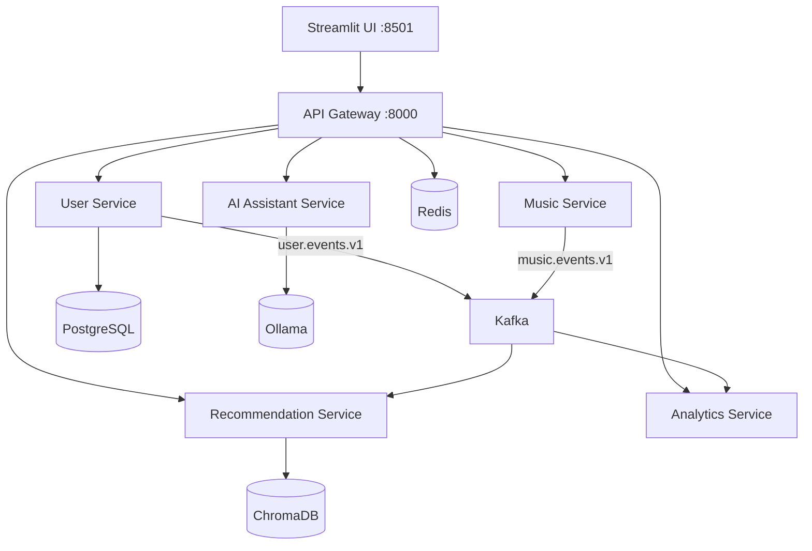

# Architecture Document

## Overview

Spotigram follows a **Hexagonal Architecture** (Ports & Adapters) within each service, combined with **Domain-Driven Design** at the bounded-context level and **Event-Driven Architecture** for inter-service communication.

## Architectural Principles

1. **Service Isolation** — Each service owns its database. No cross-service DB access.
2. **API-First** — All inter-service communication goes through versioned REST APIs or Kafka events.
3. **AI Sandbox** — LangChain and LangGraph are allowed only inside `ai-assistant-service`.
4. **Observability-First** — Every service exposes `/health`, `/ready`, and `/metrics`.
5. **Resilience Engineering** — Circuit breakers, retries with exponential backoff, DLQ for Kafka.

## Service Architecture

### Per-Service Layer Structure (Hexagonal)

```
service/
├── api/v1/router.py          # Driving adapter (HTTP)
├── application/               # Use cases / application services
├── domain/                    # Pure domain models, no framework imports
├── infrastructure/            # Driven adapters (DB, Kafka, external APIs)
├── main.py                    # FastAPI app with /health, /ready, /metrics
├── Dockerfile
├── requirements.txt
└── tests/
```

- **Domain Layer**: Pure Python dataclasses and enums. Zero framework dependencies.
- **Application Layer**: Orchestrates domain logic. Depends on domain interfaces, never on infrastructure directly.
- **Infrastructure Layer**: Implements ports (PostgreSQL repos, Kafka publishers, ChromaDB clients).
- **API Layer**: FastAPI routers. Converts HTTP requests to application calls and domain objects.

## Service Boundaries



### API Gateway
- **Responsibility**: Rate limiting (Redis-backed), JWT validation, correlation ID propagation, request proxying.
- **Tech**: FastAPI, `fastapi-limiter`, `PyJWT`.

### User Service
- **Bounded Context**: Identity & Social Graph.
- **Owns**: `users`, `profiles`, `connections` tables in PostgreSQL.
- **Events Produced**: `user.events.v1` (user.registered, user.followed).

### Music Service
- **Bounded Context**: Music Catalog & Playback.
- **Integrates**: Spotify Web API, MusicBrainz fallback, Last.fm fallback.
- **Events Produced**: `music.events.v1` (track.played, track.liked, track.skipped).

### Recommendation Service
- **Bounded Context**: Mood Detection, Music DNA, Recommendations.
- **Owns**: ChromaDB vector collections for embeddings.
- **Consumes**: `music.events.v1` to update Music DNA embeddings.
- **Key Models**: `MoodProfile`, `MusicDNA`, `Recommendation`, `RecommendationFeed`.

### AI Assistant Service
- **Bounded Context**: Conversational AI & Playlist Generation.
- **Tech**: LangChain Core, LangGraph StateGraph, multi-provider (Ollama/Grok/Gemini).
- **Key Features**: RAG chain, tool-calling chain, AI DJ workflow (LangGraph state machine).

### Analytics Service
- **Bounded Context**: Aggregated Listening Analytics.
- **Consumes**: `music.events.v1`, `user.events.v1` via Kafka.
- **Owns**: Materialized daily stats in PostgreSQL.

## Event-Driven Communication

| Topic | Producer | Consumer(s) | Payload |
|---|---|---|---|
| `user.events.v1` | User Service | Analytics Service | user_id, event_type, display_name |
| `music.events.v1` | Music Service | Recommendation Service, Analytics Service | user_id, track_id, action |
| `outbox.events` | Any (via Outbox pattern) | — | Transactional event relay |
| `spotigram.dlq` | DLQ Kafka Consumer | — | Failed messages + error context |
| `spotigram.retry` | — | — | Retry queue |

## Data Stores

| Store | Service(s) | Purpose |
|---|---|---|
| PostgreSQL | User, Analytics | Relational data (users, profiles, connections, daily stats) |
| Redis | API Gateway | Rate limiting, idempotency caching |
| ChromaDB | Recommendation | Vector embeddings for Music DNA similarity search |
| Ollama | AI Assistant | Local LLM inference |

## Security Architecture

- **JWT** with `HS256`, secret from `JWT_SECRET` env var.
- **bcrypt** password hashing via `passlib`.
- **Rate Limiting**: 100 requests/minute per user via Redis-backed `fastapi-limiter`.
- **Auth Middleware**: Validates Bearer tokens on all `/api/` routes except `/api/v1/auth/*`.
