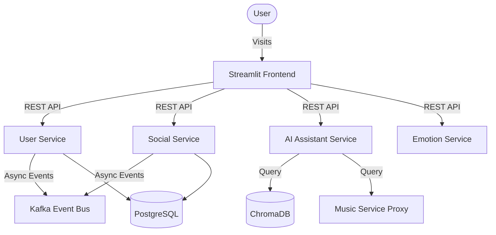
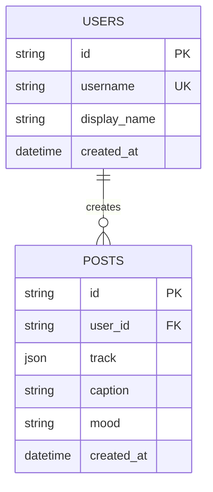
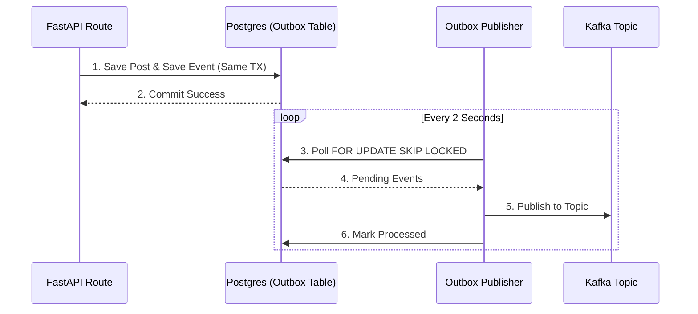
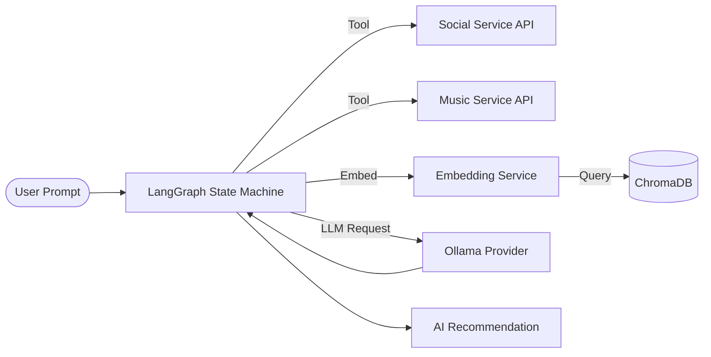

# SpotiGram Architecture Overview

SpotiGram is built using a modern, event-driven, Hexagonal Architecture pattern.

## 1. System Context (C4 Model)

## 2. Entity Relationship Diagram (ERD)

## 3. Event-Driven Architecture (Kafka Flow)

We employ the **Outbox Pattern** to ensure reliable message delivery without distributed transactions.

## 4. AI Subsystem (RAG & Music DNA)

The `ai-assistant-service` acts as the orchestrator using LangGraph.

