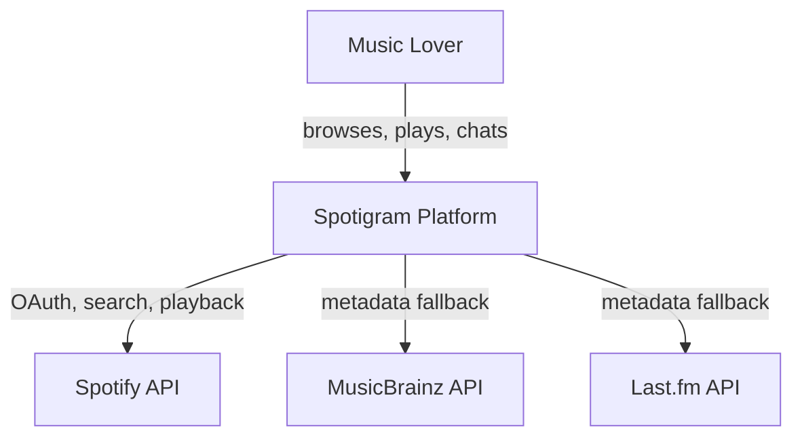
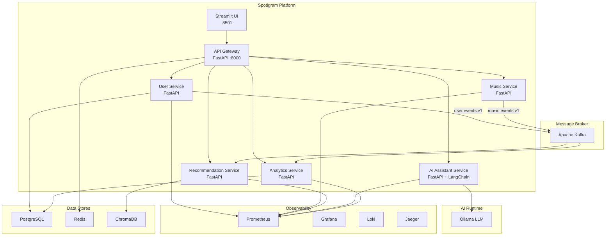
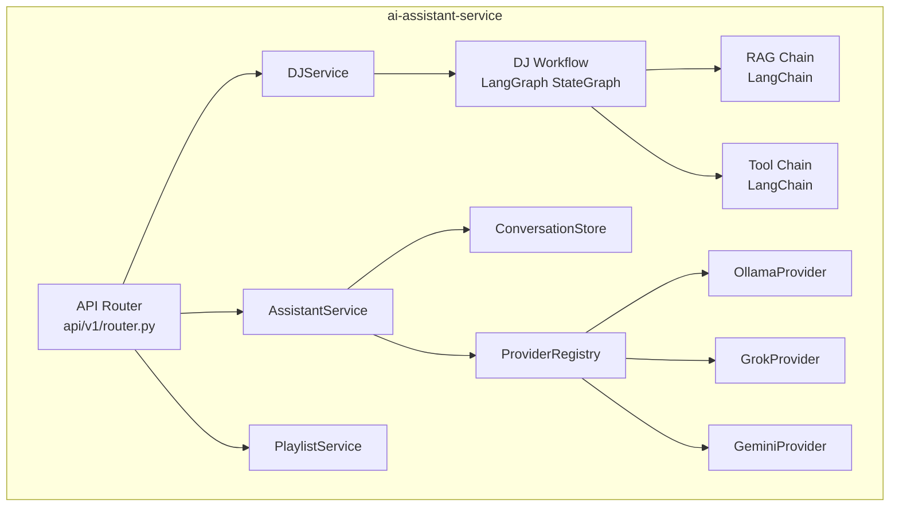

# C4 Diagrams

## Level 1: System Context

```mermaid
graph TD
    User["Music Lover"]
    Spotify["Spotify API"]
    MusicBrainz["MusicBrainz API"]
    LastFM["Last.fm API"]

    User -->|"browses, plays, chats"| SG["Spotigram Platform"]
    SG -->|"OAuth, search, playback"| Spotify
    SG -->|"metadata fallback"| MusicBrainz
    SG -->|"metadata fallback"| LastFM
```

## Level 2: Container Diagram

```mermaid
graph TD
    subgraph "Spotigram Platform"
        UI["Streamlit UI<br/>:8501"]
        GW["API Gateway<br/>FastAPI :8000"]
        US["User Service<br/>FastAPI"]
        MS["Music Service<br/>FastAPI"]
        RS["Recommendation Service<br/>FastAPI"]
        AI["AI Assistant Service<br/>FastAPI + LangChain"]
        AN["Analytics Service<br/>FastAPI"]
    end

    subgraph "Data Stores"
        PG["PostgreSQL"]
        RD["Redis"]
        CH["ChromaDB"]
    end

    subgraph "Message Broker"
        KF["Apache Kafka"]
    end

    subgraph "AI Runtime"
        OL["Ollama LLM"]
    end

    subgraph "Observability"
        PR["Prometheus"]
        GR["Grafana"]
        LK["Loki"]
        JG["Jaeger"]
    end

    UI --> GW
    GW --> US
    GW --> MS
    GW --> RS
    GW --> AI
    GW --> AN

    GW --> RD
    US --> PG
    AN --> PG
    RS --> CH
    AI --> OL

    US -->|"user.events.v1"| KF
    MS -->|"music.events.v1"| KF
    KF --> RS
    KF --> AN

    US --> PR
    MS --> PR
    RS --> PR
    AI --> PR
    AN --> PR
```

## Level 3: Component Diagram (AI Assistant Service)

```mermaid
graph TD
    subgraph "ai-assistant-service"
        Router["API Router<br/>api/v1/router.py"]
        AssistantSvc["AssistantService"]
        DJSvc["DJService"]
        PlaylistSvc["PlaylistService"]
        ProvReg["ProviderRegistry"]
        MemStore["ConversationStore"]
        RAGChain["RAG Chain<br/>LangChain"]
        ToolChain["Tool Chain<br/>LangChain"]
        DJWorkflow["DJ Workflow<br/>LangGraph StateGraph"]
        OllamaP["OllamaProvider"]
        GrokP["GrokProvider"]
        GeminiP["GeminiProvider"]
    end

    Router --> AssistantSvc
    Router --> DJSvc
    Router --> PlaylistSvc
    AssistantSvc --> ProvReg
    AssistantSvc --> MemStore
    DJSvc --> DJWorkflow
    DJWorkflow --> RAGChain
    DJWorkflow --> ToolChain
    ProvReg --> OllamaP
    ProvReg --> GrokP
    ProvReg --> GeminiP
```
