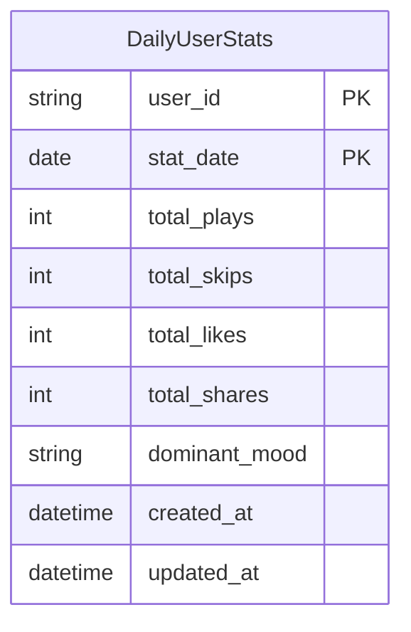

# ER Diagrams

## User Service Database

```mermaid
erDiagram
    UserAccount ||--o| UserProfile : has
    UserAccount ||--o{ Connection : "follower"
    UserAccount ||--o{ Connection : "followed"

    UserAccount {
        string id PK "UUID"
        string email UK "indexed"
        string password_hash
        enum status "PENDING_VERIFICATION | ACTIVE | SUSPENDED | DELETED"
        datetime created_at
    }

    UserProfile {
        string user_id PK FK "references users.id"
        string display_name
        text bio
        string avatar_url
        string privacy_status "PUBLIC | PRIVATE"
    }

    Connection {
        string id PK "UUID"
        string follower_id FK "references users.id, indexed"
        string followed_id FK "references users.id, indexed"
        enum status "ACTIVE | BLOCKED | MUTED"
        datetime timestamp
    }
```

## Analytics Service Database



## Recommendation Service (ChromaDB Collections)

ChromaDB stores vector embeddings, not relational tables. The logical structure:

| Collection | Document ID | Embedding | Metadata |
|---|---|---|---|
| `track_embeddings` | `track_id` | 384-dim float vector | title, artist, genres |
| `user_dna` | `user_id` | 384-dim float vector | top_genres, top_artists, mood_distribution |
