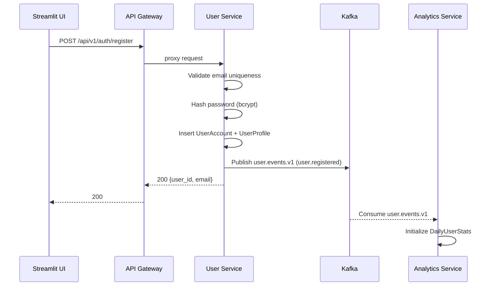
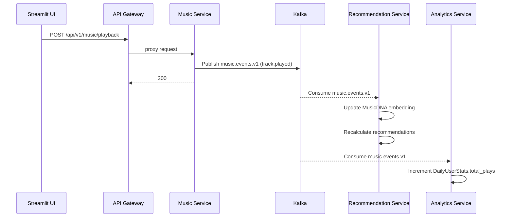
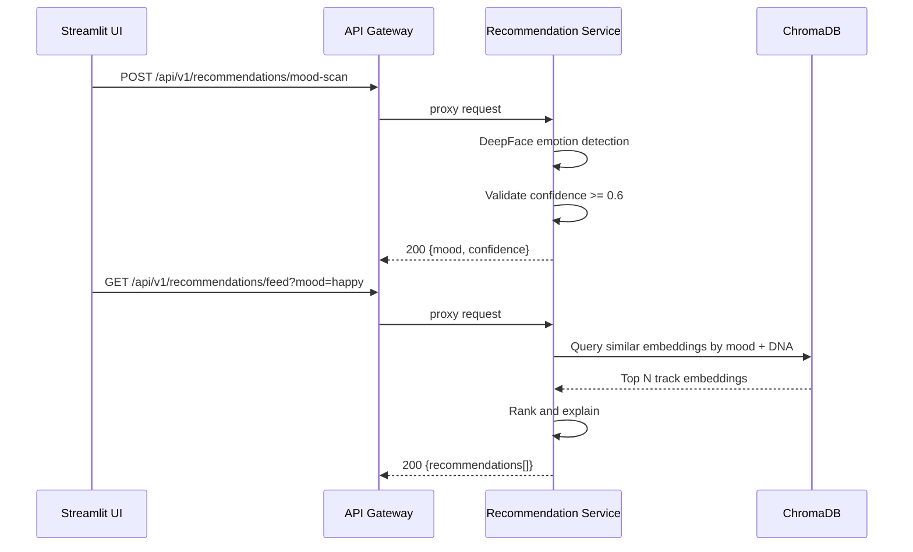
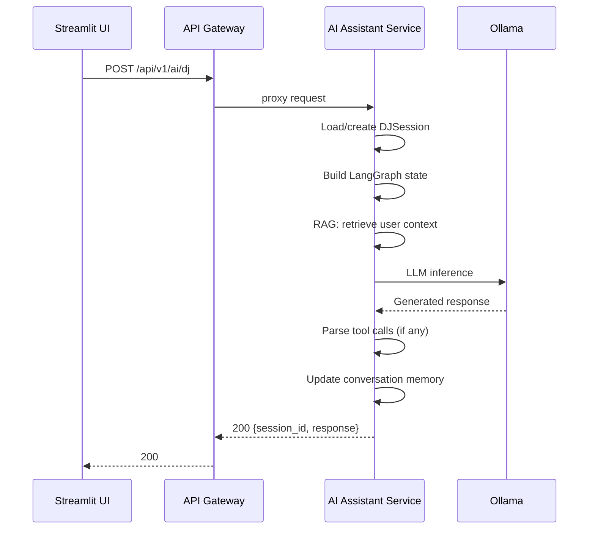
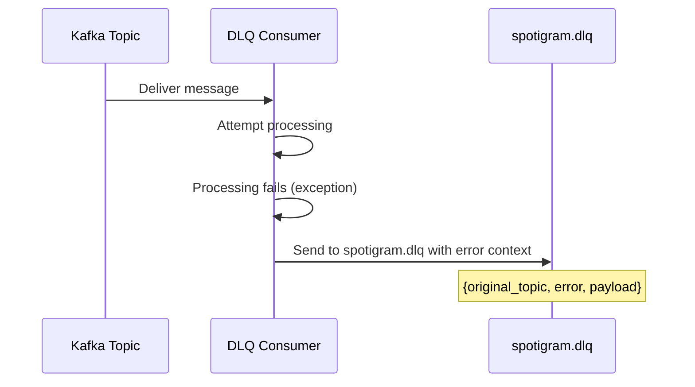

# Event Flow Diagrams

## User Registration Flow

```mermaid
sequenceDiagram
    participant UI as Streamlit UI
    participant GW as API Gateway
    participant US as User Service
    participant K as Kafka
    participant AN as Analytics Service

    UI->>GW: POST /api/v1/auth/register
    GW->>US: proxy request
    US->>US: Validate email uniqueness
    US->>US: Hash password (bcrypt)
    US->>US: Insert UserAccount + UserProfile
    US->>K: Publish user.events.v1 (user.registered)
    US-->>GW: 200 {user_id, email}
    GW-->>UI: 200

    K-->>AN: Consume user.events.v1
    AN->>AN: Initialize DailyUserStats
```

## Track Playback Flow

```mermaid
sequenceDiagram
    participant UI as Streamlit UI
    participant GW as API Gateway
    participant MS as Music Service
    participant K as Kafka
    participant RS as Recommendation Service
    participant AN as Analytics Service

    UI->>GW: POST /api/v1/music/playback
    GW->>MS: proxy request
    MS->>K: Publish music.events.v1 (track.played)
    MS-->>GW: 200

    K-->>RS: Consume music.events.v1
    RS->>RS: Update MusicDNA embedding
    RS->>RS: Recalculate recommendations

    K-->>AN: Consume music.events.v1
    AN->>AN: Increment DailyUserStats.total_plays
```

## Mood Scan → Recommendation Flow

```mermaid
sequenceDiagram
    participant UI as Streamlit UI
    participant GW as API Gateway
    participant RS as Recommendation Service
    participant CH as ChromaDB

    UI->>GW: POST /api/v1/recommendations/mood-scan
    GW->>RS: proxy request
    RS->>RS: DeepFace emotion detection
    RS->>RS: Validate confidence >= 0.6
    RS-->>GW: 200 {mood, confidence}

    UI->>GW: GET /api/v1/recommendations/feed?mood=happy
    GW->>RS: proxy request
    RS->>CH: Query similar embeddings by mood + DNA
    CH-->>RS: Top N track embeddings
    RS->>RS: Rank and explain
    RS-->>GW: 200 {recommendations[]}
```

## AI DJ Interaction Flow

```mermaid
sequenceDiagram
    participant UI as Streamlit UI
    participant GW as API Gateway
    participant AI as AI Assistant Service
    participant OL as Ollama

    UI->>GW: POST /api/v1/ai/dj
    GW->>AI: proxy request
    AI->>AI: Load/create DJSession
    AI->>AI: Build LangGraph state
    AI->>AI: RAG: retrieve user context
    AI->>OL: LLM inference
    OL-->>AI: Generated response
    AI->>AI: Parse tool calls (if any)
    AI->>AI: Update conversation memory
    AI-->>GW: 200 {session_id, response}
    GW-->>UI: 200
```

## Kafka Dead Letter Queue Flow

```mermaid
sequenceDiagram
    participant K as Kafka Topic
    participant C as DLQ Consumer
    participant DLQ as spotigram.dlq

    K->>C: Deliver message
    C->>C: Attempt processing
    C->>C: Processing fails (exception)
    C->>DLQ: Send to spotigram.dlq with error context
    Note over DLQ: {original_topic, error, payload}
```
