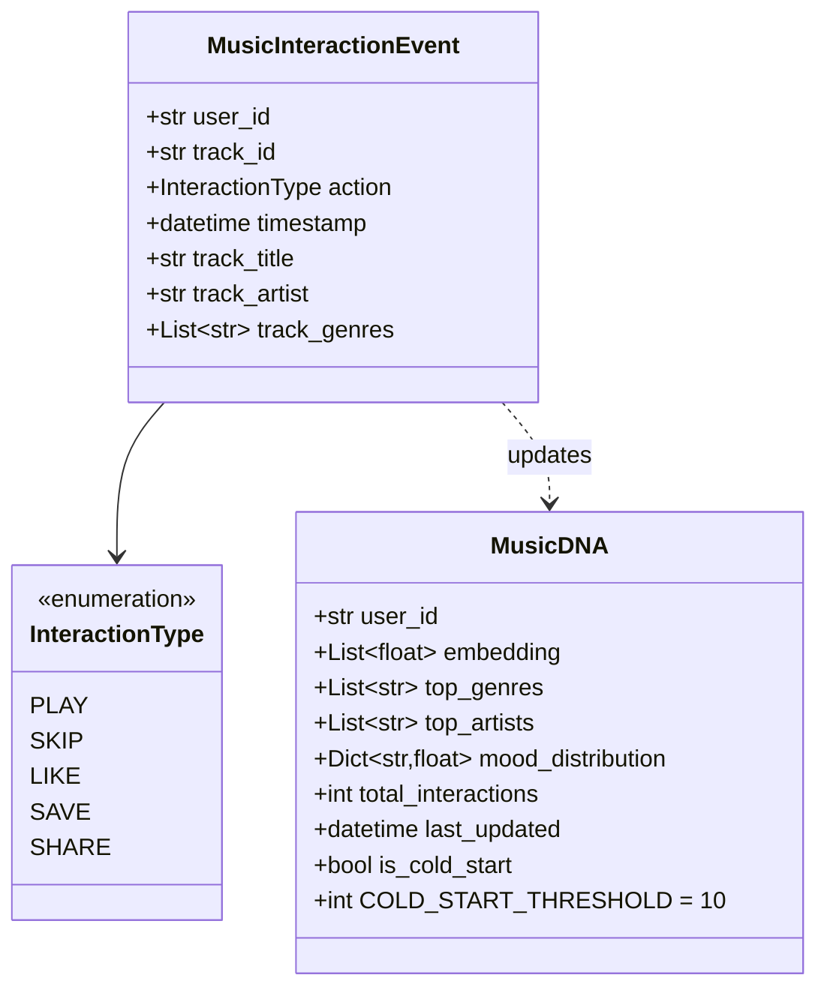
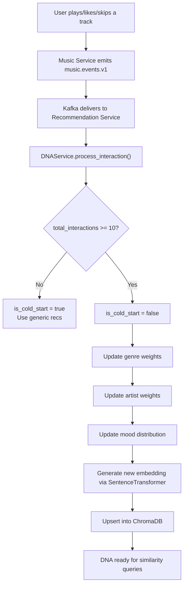
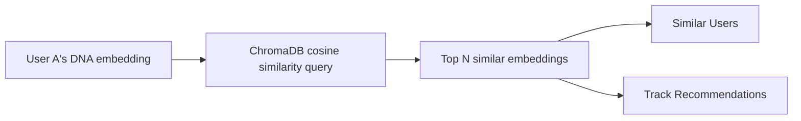

# Music DNA Diagrams

## What Is Music DNA?

Music DNA is a vector embedding that represents a user's unique musical fingerprint, built from their listening history, genre affinities, mood distribution, and interaction signals.

## Music DNA Data Model

## DNA Update Pipeline

## DNA Similarity Search

## DNA Cold Start Strategy

| Phase | Interactions | Strategy |
|---|---|---|
| **Cold Start** | 0–9 | Generic genre-based recommendations, trending tracks |
| **Warm** | 10–50 | DNA-driven recs with high exploration factor |
| **Mature** | 50+ | Full DNA similarity, mood-filtered, socially-aware |
