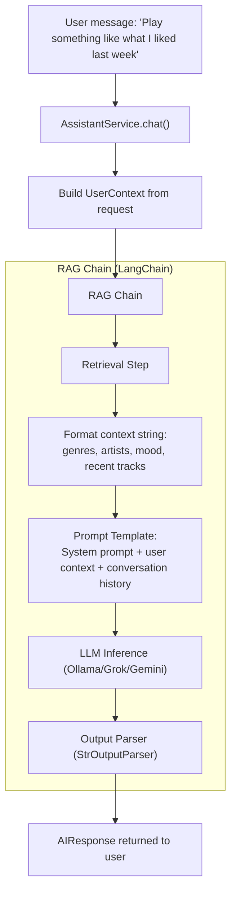
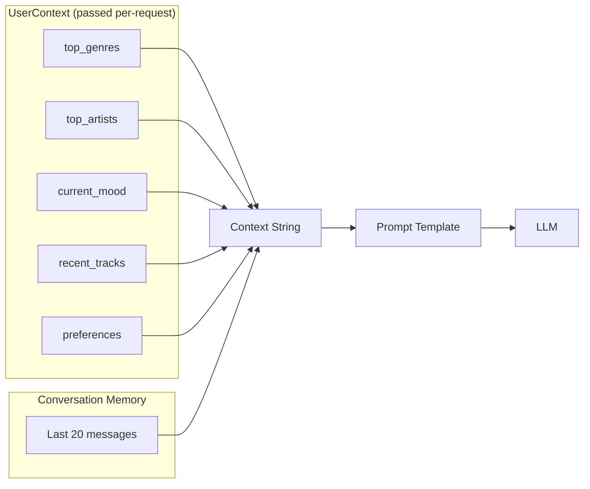
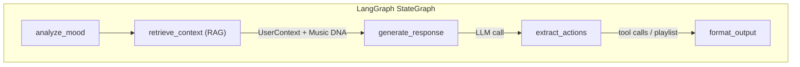

# RAG Diagrams

## RAG Architecture in AI Assistant Service

The AI Assistant Service uses **Retrieval-Augmented Generation (RAG)** to ground LLM responses in the user's actual Music DNA and listening history.

## RAG Pipeline

## Context Sources

## RAG in AI DJ Workflow

## Key Design Decisions

- **No direct DB calls**: The AI service receives all context via the `UserContext` object in the API request. It never queries PostgreSQL or ChromaDB directly.
- **LangChain Core only**: Uses `langchain_core` (prompts, parsers, runnables), not the full `langchain` package.
- **Provider-agnostic**: The RAG chain works identically regardless of which LLM provider is active.
