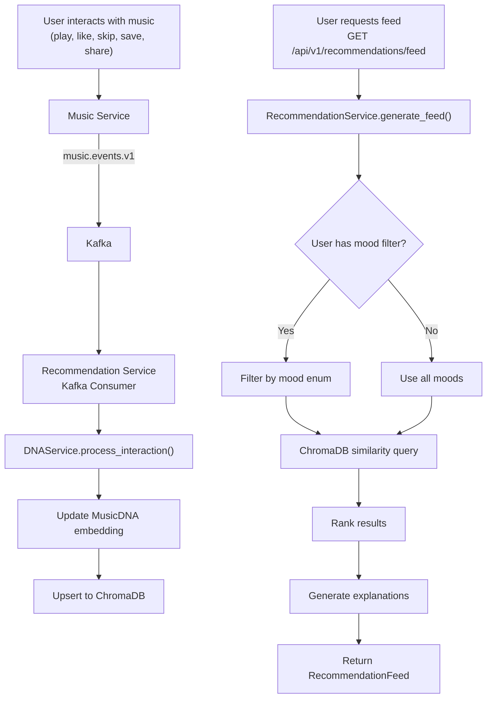
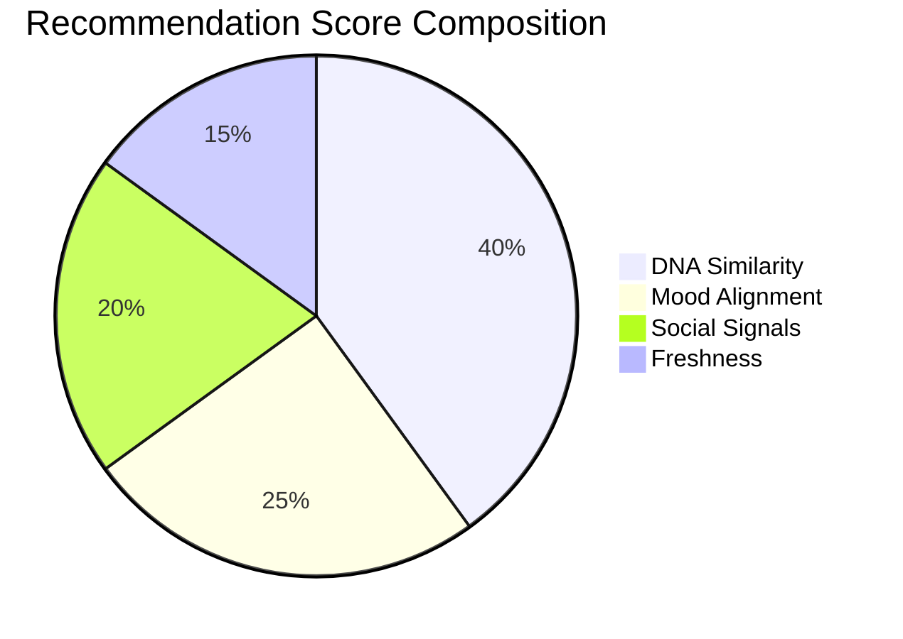
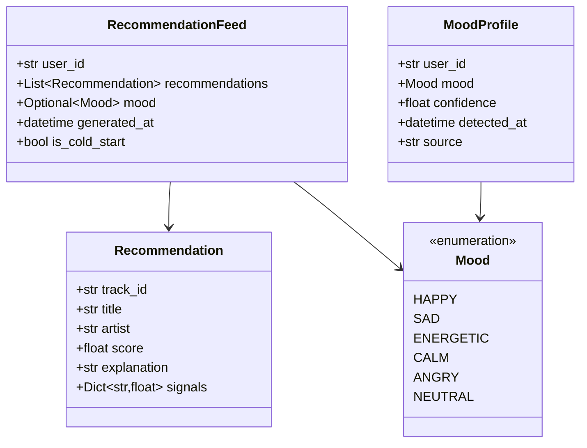
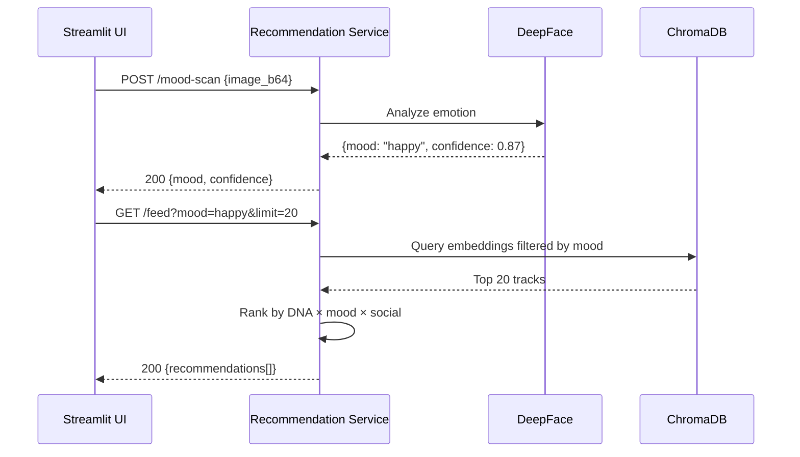

# Recommendation Pipeline Diagrams

## End-to-End Recommendation Flow

```mermaid
flowchart TD
    A["User interacts with music<br/>(play, like, skip, save, share)"]
    A --> B["Music Service"]
    B -->|"music.events.v1"| C["Kafka"]
    C --> D["Recommendation Service<br/>Kafka Consumer"]
    D --> E["DNAService.process_interaction()"]
    E --> F["Update MusicDNA embedding"]
    F --> G["Upsert to ChromaDB"]

    H["User requests feed<br/>GET /api/v1/recommendations/feed"]
    H --> I["RecommendationService.generate_feed()"]
    I --> J{"User has mood filter?"}
    J -->|Yes| K["Filter by mood enum"]
    J -->|No| L["Use all moods"]
    K --> M["ChromaDB similarity query"]
    L --> M
    M --> N["Rank results"]
    N --> O["Generate explanations"]
    O --> P["Return RecommendationFeed"]
```

## Ranking Signal Breakdown

```mermaid
pie title Recommendation Score Composition
    "DNA Similarity" : 40
    "Mood Alignment" : 25
    "Social Signals" : 20
    "Freshness" : 15
```

## Recommendation Domain Model

```mermaid
classDiagram
    class RecommendationFeed {
        +str user_id
        +List~Recommendation~ recommendations
        +Optional~Mood~ mood
        +datetime generated_at
        +bool is_cold_start
    }

    class Recommendation {
        +str track_id
        +str title
        +str artist
        +float score
        +str explanation
        +Dict~str,float~ signals
    }

    class MoodProfile {
        +str user_id
        +Mood mood
        +float confidence
        +datetime detected_at
        +str source
    }

    class Mood {
        <<enumeration>>
        HAPPY
        SAD
        ENERGETIC
        CALM
        ANGRY
        NEUTRAL
    }

    RecommendationFeed --> Recommendation
    RecommendationFeed --> Mood
    MoodProfile --> Mood
```

## Mood-to-Recommendation Pipeline

```mermaid
sequenceDiagram
    participant UI as Streamlit UI
    participant RS as Recommendation Service
    participant DF as DeepFace
    participant CH as ChromaDB

    UI->>RS: POST /mood-scan {image_b64}
    RS->>DF: Analyze emotion
    DF-->>RS: {mood: "happy", confidence: 0.87}
    RS-->>UI: 200 {mood, confidence}

    UI->>RS: GET /feed?mood=happy&limit=20
    RS->>CH: Query embeddings filtered by mood
    CH-->>RS: Top 20 tracks
    RS->>RS: Rank by DNA × mood × social
    RS-->>UI: 200 {recommendations[]}
```
