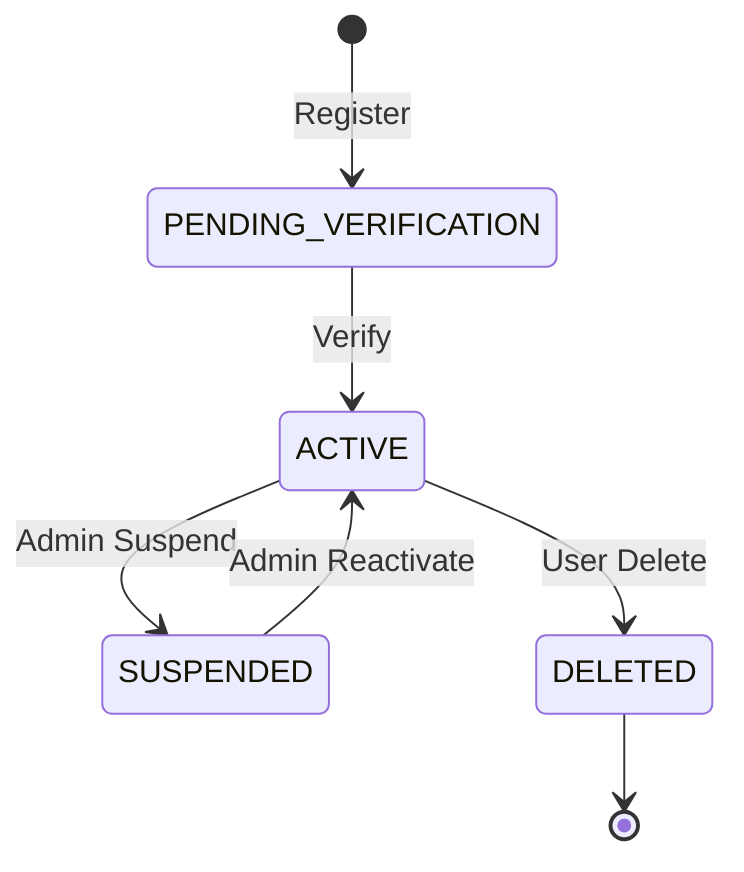

# User Domain Specification

## 1. Overview
The User Domain manages identity, profile information, and account lifecycle. It is the foundational boundary for the `user-service`.

## 2. Entities & Aggregates
- **Aggregate Root**: `UserAccount`
  - **Entity**: `UserProfile`
  - **Value Objects**: `EmailAddress`, `PasswordHash`, `PrivacySettings`

## 3. Workflows
- **Registration**: Capture email/pass or OAuth token -> Hash password -> Create UserAccount -> Publish `UserRegisteredEvent`.
- **Login**: Validate credentials -> Issue short-lived JWT & refresh token.
- **Password Reset**: Generate signed JWT reset token -> Send email -> Verify token -> Update Hash.
- **Refresh Token Rotation**: Validate old refresh token -> Invalidate old -> Issue new pair.
- **Account Verification**: Send OTP/Link -> Verify -> Update Status to `ACTIVE`.
- **Account Deletion**: Soft delete by setting status to `DELETED`.
- **Suspension/Reactivation**: Admin toggles status to `SUSPENDED` or `ACTIVE`.
- **Profile Updates**: Update metadata (Display Name, Avatar, Bio).
- **Privacy Settings**: Toggle public/private profile visibility.

## 4. State Transitions

## 5. Validations & Rules
- Email must be unique.
- Password must meet minimum complexity (8 chars, 1 number, 1 special).
- Cannot login if `SUSPENDED`.

## 6. Permissions (RBAC)
- **User**: Can read own account, update own profile, delete own account.
- **Admin**: Can read any account, suspend, reactivate.

## 7. Edge Cases & Failure Behavior
- Token replay attacks: Mitigated by token rotation and blocklisting.
- Registration with existing email: Return generic "If email exists, a reset link was sent" to prevent enumeration.

## 8. Domain Event List
- `UserRegisteredEvent`
- `UserProfileUpdatedEvent`
- `UserSuspendedEvent`
- `UserDeletedEvent`

## 9. Test Scenarios
- **Given** an active user, **When** they update their display name, **Then** the profile is updated and `UserProfileUpdatedEvent` is emitted.
- **Given** a suspended user, **When** they attempt login, **Then** authentication fails with `AccountSuspendedException`.
