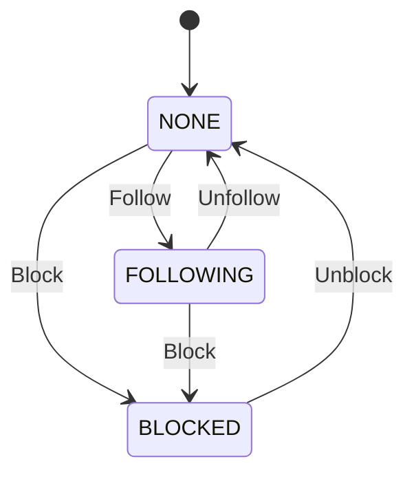

# Social Domain Specification

## 1. Overview
The Social Domain manages the relationships and interactions between users, acting as the core of the Spotigram network. It is housed in the `user-service`.

## 2. Entities & Aggregates
- **Aggregate Root**: `SocialGraph`
  - **Entity**: `Connection` (Follow/Block/Mute)
  - **Entity**: `Interaction` (Like/Comment/Share)

## 3. Workflows
- **Follow/Unfollow**: Validate target exists -> Create/Delete `Connection` -> Adjust counters -> Publish `UserFollowedEvent`.
- **Block/Unblock**: Create `BlockConnection` -> Delete bidirectional Follows -> Publish `UserBlockedEvent`.
- **Mute**: Create `MuteConnection` (hides content from feed without unfollowing).
- **Report**: Create `ReportEntity` -> Send to Admin Queue.
- **Like/Unlike**: Increment/Decrement post like counter -> Publish `PostLikedEvent`.
- **Comment/Delete Comment**: Append/Remove text node to a Feed Post -> Publish `PostCommentedEvent`.
- **Share**: DM a post/track to another user.
- **Repost**: Clone post reference to user's own feed timeline.

## 4. State Transitions

## 5. Validations & Rules
- Users cannot follow blocked users.
- Users cannot comment on posts from blocked users.
- Maximum 1 like per user per post.

## 6. Permissions (RBAC)
- **User**: Can manage own relationships, comments, and likes.
- **Admin**: Can review reports and enforce blocks globally.

## 7. Edge Cases & Failure Behavior
- High-concurrency likes (e.g., viral post): Buffer increments or use Redis counters before committing to DB to prevent lock contention.
- Ghost follows (race conditions): Idempotency keys required on follow requests.

## 8. Domain Event List
- `UserFollowedEvent`
- `UserUnfollowedEvent`
- `UserBlockedEvent`
- `PostLikedEvent`
- `PostCommentedEvent`
- `ContentReportedEvent`

## 9. Test Scenarios
- **Given** User A blocks User B, **When** User B tries to follow User A, **Then** an `ActionNotPermittedException` is thrown.
