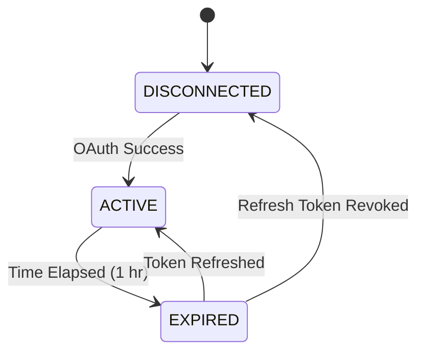

# Music Domain Specification

## 1. Overview
The Music Domain manages metadata, streaming URIs, and Spotify integration logic. Hosted in the `music-service`.

## 2. Entities & Aggregates
- **Aggregate Root**: `Track`
  - **Value Objects**: `SpotifyURI`, `ISRC`
  - **Entities**: `Artist`, `Album`
- **Aggregate Root**: `Playlist`

## 3. Workflows
- **Spotify OAuth**: Exchange auth code for user access token -> Store securely -> Sync initial top tracks.
- **Token Refresh**: Cron or interceptor detects expiry -> Refresh via Spotify API -> Update DB.
- **Search**: Proxy query to Spotify Search API -> Normalize response to Spotigram schemas.
- **Playlists**: Create playlist -> Sync to Spotify -> Update local DB metadata.
- **Playback**: Provide Spotify Track URIs to the Streamlit JS Frontend.
- **Import/Export**: Bulk read Spotify playlists / Bulk write Spotigram lists.
- **Fallback Metadata Source**: If Spotify lacks genres/tags -> Query MusicBrainz -> Query Last.fm -> Merge.

## 4. State Transitions (Spotify Token)

## 5. Validations & Rules
- Premium-only Playback: Check `product` flag in Spotify user profile. If `free`, deny playback request to frontend.
- Fallback merging: Spotify is source of truth; fallbacks only fill `null` fields.

## 6. Permissions (RBAC)
- **User**: Read/Write own playlists.
- **System**: Execute token refreshes.

## 7. Edge Cases & Failure Behavior
- Spotify API Rate Limiting (429): Implement exponential backoff and circuit breaker.
- Last.fm Down: Gracefully skip secondary fallback.

## 8. Domain Event List
- `TrackPlayedEvent`
- `SpotifyAccountLinkedEvent`
- `PlaylistImportedEvent`

## 9. Test Scenarios
- **Given** a missing genre in Spotify data, **When** searching for a track, **Then** the service queries MusicBrainz and populates the genre field.
- **Given** a free Spotify user, **When** requesting playback tokens, **Then** a `PremiumRequiredException` is thrown.
