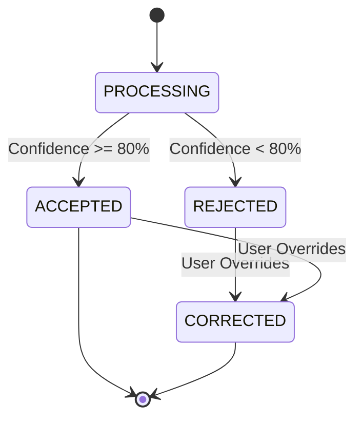

# Mood Domain Specification

## 1. Overview
The Mood Domain processes camera input and semantic emotional mapping to drive recommendations. Hosted in the `ai-assistant-service`.

## 2. Entities & Aggregates
- **Aggregate Root**: `MoodScan`
  - **Value Objects**: `ConfidenceScore`, `MoodType`

## 3. Workflows
- **Mood Scan Lifecycle**: Receive base64 image -> Process via ML Model (or proxy) -> Map raw emotion to `MoodType` -> Save History -> Publish `MoodScannedEvent`.
- **Confidence Threshold**: If confidence < 80%, flag as `REJECTED`.
- **Rejected Scan Behavior**: Prompt user with top 2 guesses for manual selection.
- **Mood Correction**: User overrides detected mood -> Update `MoodScan` state -> Recalibrate.
- **History Retention**: Store scans for 30 days to build mood analytics.

## 4. State Transitions

## 5. Validations & Rules
- Base64 payload must not exceed 5MB.
- Manual correction must occur within 5 minutes of scan.

## 6. Permissions (RBAC)
- **User**: Can initiate scans and override own scans.

## 7. Edge Cases & Failure Behavior
- No Face Detected: Reject scan immediately with `NoFaceDetectedException`.
- Local AI Model Down: Fail gracefully to manual mood picker.

## 8. Domain Event List
- `MoodScannedEvent`
- `MoodCorrectedEvent`

## 9. Test Scenarios
- **Given** a scan with 75% confidence, **When** processed, **Then** state is `REJECTED` and system prompts for manual correction.
