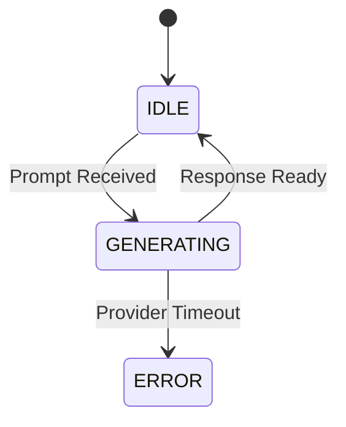

# AI DJ Domain Specification

## 1. Overview
The AI DJ Domain provides a conversational interface for generating playlists and managing mood requests. Hosted in the `ai-assistant-service`.

## 2. Entities & Aggregates
- **Aggregate Root**: `DJSession`
  - **Entity**: `ChatMessage`
  - **Value Object**: `ProviderConfig`

## 3. Workflows
- **AI Chat**: Receive user prompt -> Retrieve recent `DJSession` context -> Send to LLM -> Parse JSON output -> Return `ChatResponse`.
- **Playlist Generation**: LLM maps semantic request ("upbeat 90s") to Spotify search queries -> Fetch IDs -> Construct Playlist object.
- **Mood-Based Requests**: Process implicit mood from text -> Update user's current session mood.
- **Provider Selection**: Check user settings -> Route to Ollama (default), Grok, or Gemini.

## 4. State Transitions

## 5. Validations & Rules
- Context window limited to last 10 messages per session.
- Only LangChain/LangGraph may be used for orchestration in this specific domain.

## 6. Permissions (RBAC)
- **User**: Can chat and generate playlists.
- **Premium User**: Can select non-default (Cloud) AI providers.

## 7. Edge Cases & Failure Behavior
- **Memory Behavior**: DJ must gracefully ignore contradictory past prompts.
- **Fallback Behavior**: If Ollama times out (5s), immediately switch to predefined algorithm fallback ("Sorry, I lost my voice. Here is a generic mix").

## 8. Domain Event List
- `DJSessionStartedEvent`
- `PlaylistGeneratedByAIEvent`

## 9. Test Scenarios
- **Given** a prompt "play happy music", **When** processed by the LLM, **Then** the resulting tracks have a valence score > 0.7.
