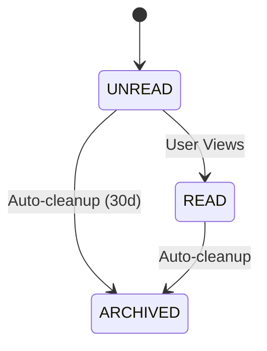

# Notification Domain Specification

## 1. Overview
The Notification Domain routes cross-domain events to users via Push, Email, or In-App channels.

## 2. Entities & Aggregates
- **Aggregate Root**: `NotificationInbox`
  - **Entity**: `Notification`

## 3. Workflows
- **Creation**: Listen to `UserFollowedEvent`, `PostLikedEvent`, etc. -> Format message based on user locale.
- **Deduplication**: Check Redis for recent identical notification (e.g., same user liking same post twice).
- **Delivery**: Push payload to FCM/APNs or WebSocket.
- **Read/Unread**: User views inbox -> Mark all as read.
- **Retry Behavior**: If FCM fails -> DLQ -> Retry with exponential backoff (max 3 times).

## 4. State Transitions

## 5. Validations & Rules
- Respect "Quiet Hours" configured in User Privacy Settings.

## 6. Permissions (RBAC)
- **User**: Can view own inbox.

## 7. Edge Cases & Failure Behavior
- **Spam Control**: If a post goes viral, batch "User A and 50 others liked your post" instead of 50 singular notifications.

## 8. Domain Event List
- `NotificationSentEvent`

## 9. Test Scenarios
- **Given** a user has quiet hours enabled, **When** a `PostLikedEvent` occurs, **Then** the notification is queued but not delivered until quiet hours end.
