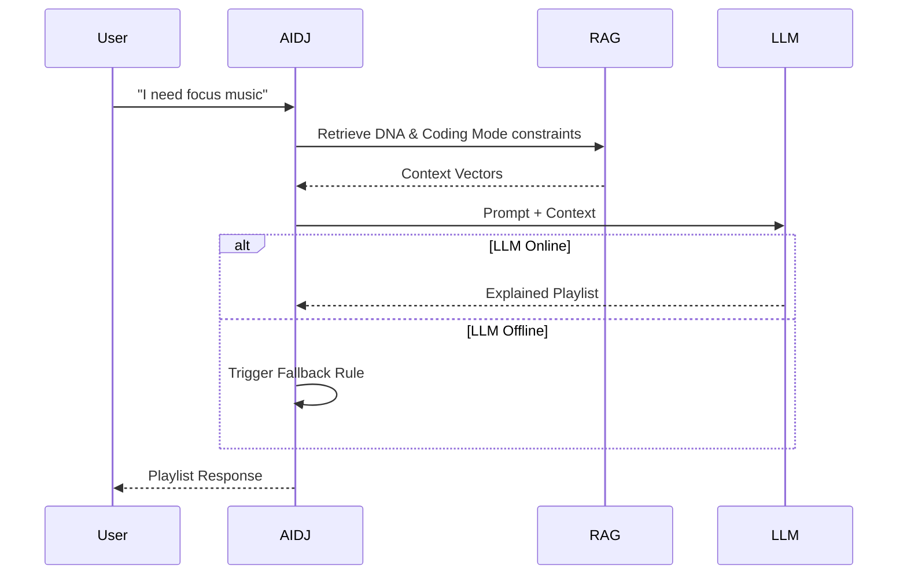

# AI DJ Domain Specification

## 1. Domain Overview
The AI DJ Domain defines the conversational and curatorial agent that users interact with to generate dynamic, context-aware playlists.

## 2. Aggregates & Entities
- **Aggregate Root:** `DJSession`
- **Entities:** `ChatTurn`, `CuratedPlaylist`

## 3. Business Rules

### Interactions & Modes
Users converse with the DJ or select predefined modes:
- **Coding Mode:** High focus, lo-fi, instrumental.
- **Road Trip Mode:** High energy, sing-alongs, collaborative tastes (if passengers are added to context).
- **Workout Mode:** High BPM, heavy bass.
- **Sleep Mode:** Ambient, slow decay in volume/tempo over 60 minutes.

### Rules
- **Playlist Generation:** The DJ must output a concrete list of Spotify track IDs alongside conversational text.
- **Recommendation Explanation:** The DJ must briefly explain *why* a track was chosen (e.g., "I noticed you've been listening to a lot of synthwave, so here's...").
- **Conversation Memory:** The DJ retains context for the duration of a `DJSession` (max 2 hours of inactivity). "Don't play that" modifies the immediate retrieval constraints.
- **Fallback Behavior (Ollama Unavailable):** If the primary LLM fails, the DJ degrades to a stateless, heuristic-based recommender, replying with canned text: "My circuits are crossing, but here's a great mix anyway!"

## 4. Workflows

## 5. Domain Events
- `DJSessionStartedEvent(session_id, user_id)`
- `DJModeEngagedEvent(session_id, mode_type)`
- `DJPlaylistGeneratedEvent(session_id, track_ids)`
- `DJFallbackTriggeredEvent(session_id, error_reason)`

## 6. Testability Requirements
- **Unit:** Test fallback triggering when LLM dependency is mocked to raise a timeout.
- **Integration:** Test LangGraph state transitions ensure memory is passed between turns.
