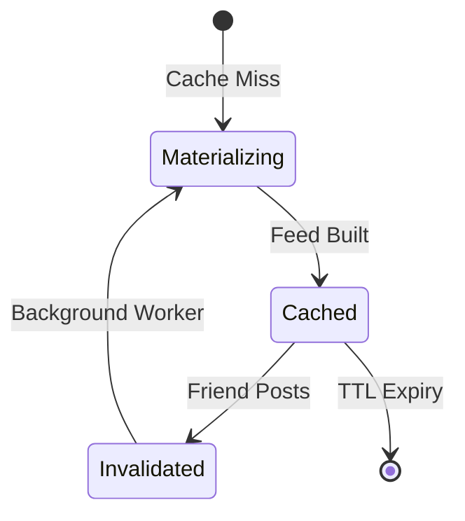

# Feed Domain Specification

## 1. Domain Overview
The Feed Domain manages the aggregation, ranking, and delivery of social posts and system recommendations to the user's home screen.

## 2. Aggregates & Entities
- **Aggregate Root:** `UserFeed`
- **Entities:** `FeedItem`

## 3. Business Rules

### Ranking & Aggregation
- **Friend Activity Ranking:** Posts from followed users are baseline.
- **Trending Algorithm:** Posts with high velocity of likes/reposts globally are inserted if they match the user's Music DNA.
- **Recommendation Insertion:** 1 AI-generated recommendation track is inserted into the feed for every 10 organic social posts.
- **Pagination:** Feed is fetched in chunks of 20 items (cursor-based pagination).

### Caching
- **Feed Refresh:** The feed is materialized asynchronously and cached in Redis.
- **Cache Invalidation:** The cache is invalidated when a followed user posts, or every 15 minutes, whichever comes first.

## 4. State Transitions

## 5. Domain Events
- `FeedMaterializedEvent(user_id, item_count)`
- `FeedItemClickedEvent(user_id, feed_item_id)`

## 6. Testability Requirements
- **Unit:** Test the insertion logic (1 recommendation per 10 organic posts).
- **Integration:** Test Redis cache invalidation hooks.
