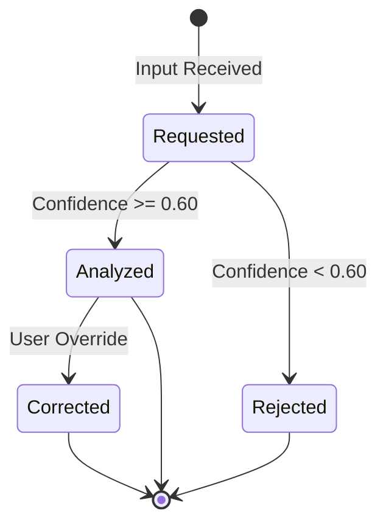

# Mood Domain Specification

## 1. Domain Overview
The Mood Domain handles the inference, categorization, and tracking of user emotions based on text input (captions, chat) or biometrics, feeding into the Music DNA.

## 2. Aggregates & Entities
- **Aggregate Root:** `MoodProfile`
- **Entities:** `MoodScan`, `MoodCorrection`

## 3. Business Rules

### Mood Scan Lifecycle
- **Scan Requested:** Text/Input is submitted for analysis.
- **Analyzed:** AI/Heuristics map the input to a core enum (Happy, Sad, Energetic, Chill).
- **Corrected:** User manually overrides the AI's detection.

### Rules & Thresholds
- **Confidence Thresholds:** The underlying sentiment analyzer must return a confidence score > 0.60. 
- **Action on Low Confidence:** If confidence < threshold, the system rejects the mood event and assigns a neutral/unknown state. The `MoodScanRejectedEvent` is emitted.
- **History Retention:** Raw mood scan text is purged after 30 days. The aggregated enums are retained indefinitely in the Music DNA.
- **User Correction:** Users can correct an inferred mood on a post. This triggers a `MoodCorrectedEvent` which updates the Music DNA and is fed back into the Analytics service to improve the model.

## 4. State Transitions

## 5. Domain Events
- `MoodScanCompletedEvent(user_id, source_id, mood_enum, confidence)`
- `MoodScanRejectedEvent(user_id, reason)`
- `MoodCorrectedEvent(user_id, source_id, old_mood, new_mood)`

## 6. Testability Requirements
- **Unit:** Test confidence threshold rejections.
- **Integration:** Test that user corrections correctly overwrite the previous scan data.
