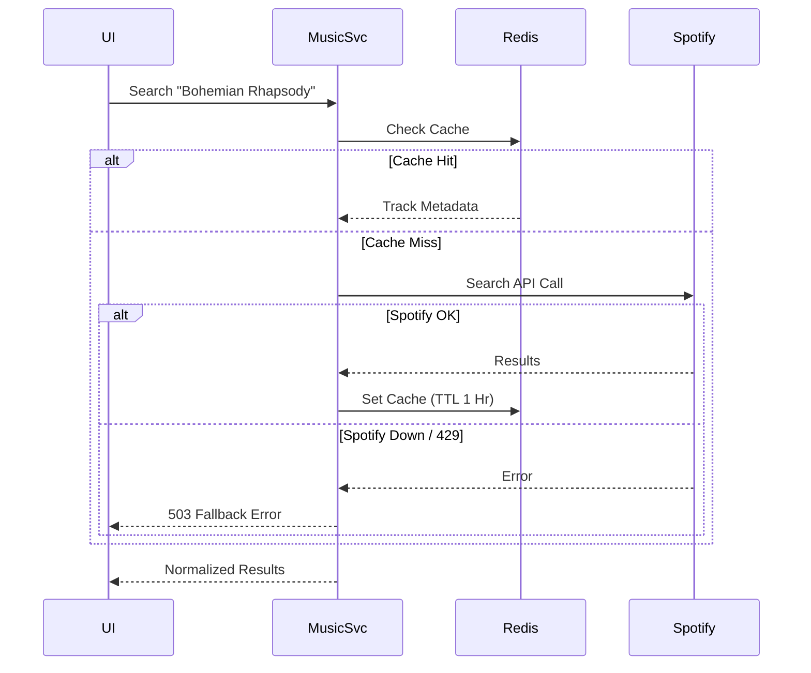

# Music Domain Specification

## 1. Domain Overview
The Music Domain acts as the anti-corruption layer and proxy between the SpotiGram ecosystem and external music providers (primarily Spotify). It abstracts away provider-specific models into our internal `TrackInfo`, `ArtistInfo`, and `AlbumInfo` domains.

## 2. Aggregates & Entities
- **Aggregate Root:** `Catalog`
- **Entities:** `Track`, `Artist`, `Album` (Internal representations of external entities)

## 3. Business Rules

### Searching & Sync
- **Search:** Supports Song, Artist, and Album search paradigms. Results are normalized to SpotiGram schemas.
- **Playlist Sync:** Can import public Spotify playlists by ID and map them to internal `Playlist` structures.
- **Spotify Synchronization:** Track metadata (ISRC, duration, title) is fetched dynamically but cached to prevent rate limits.

### Caching Rules
- **Redis TTL:** 
  - Popular Searches: 1 Hour
  - Track Metadata: 24 Hours
  - Artist Metadata: 7 Days
  - Album Metadata: 7 Days

### Failure Handling & Fallback
- **Spotify Unavailable:** If the Spotify API returns 5xx or times out, the service will:
  1. Serve from Redis cache if available (ignoring TTL temporarily if stale cache flag is enabled).
  2. Return a `503 Service Unavailable` with a `Retry-After` header.
- **Rate Limiting:** Follows `429 Too Many Requests` headers from Spotify. Triggers internal Circuit Breaker to open state, failing fast for subsequent requests until the backoff period expires.

## 4. Workflows

## 5. Domain Events
- `MusicSearchExecutedEvent(query_string, result_count)`
- `SpotifySyncFailedEvent(reason, retry_scheduled)`
- `TrackMetadataUpdatedEvent(track_id, changed_fields)`

## 6. Testability Requirements
- **Unit:** Mock external HTTP calls to test parsing of Spotify payloads into internal schemas.
- **Integration:** Test Redis cache hit/miss logic and TTL settings.
- **Contract:** Ensure SpotiGram `TrackInfo` schema remains stable regardless of upstream provider changes.
