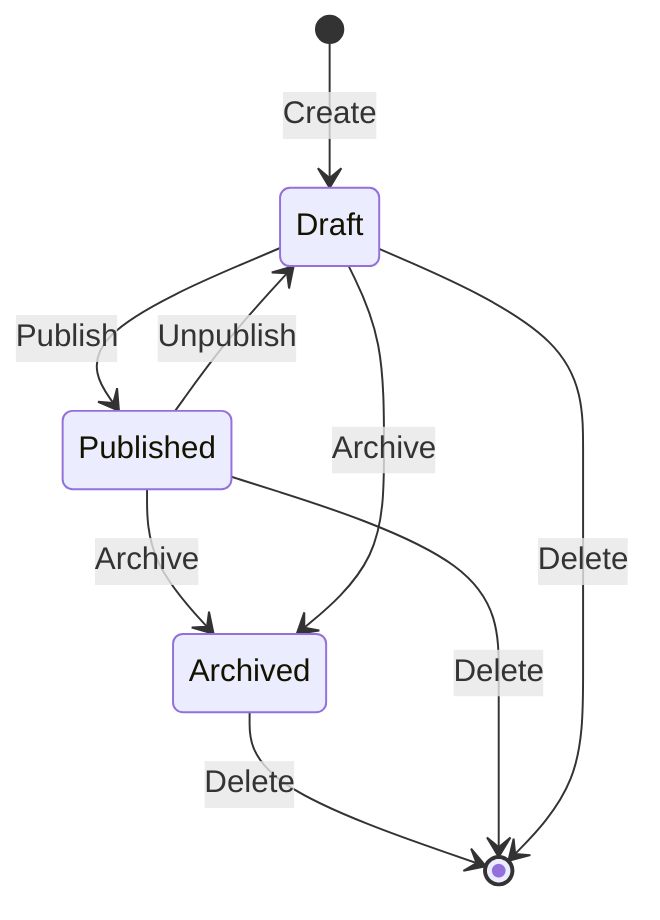

# Playlist Domain Specification

## 1. Domain Overview
The Playlist Domain handles the curation, collaboration, and lifecycle of user-generated track collections.

## 2. Aggregates & Entities
- **Aggregate Root:** `Playlist`
- **Entities:** `PlaylistTrack`, `PlaylistCollaborator`

## 3. Business Rules

### Lifecycle
- **Draft:** Playlists start in Draft mode (visible only to the owner/collaborators).
- **Published:** Available for consumption based on visibility rules.
- **Archived:** Read-only state. Cannot add or remove tracks.

### Rules & Visibility
- **Ownership:** Every playlist has a single owner. Ownership can be transferred.
- **Collaboration:** Owners can invite collaborators. Collaborators can add/remove tracks but cannot delete the playlist or change visibility.
- **Visibility:** 
  - `Public`: Searchable and visible to anyone.
  - `Private`: Visible only to owner and collaborators.
  - `Shared`: Unlisted, accessible only via direct link.

### Validation
- **Size Limits:** Maximum of 10,000 tracks per playlist.
- **Duplicate Rules:** Duplicate tracks are allowed by default, but the UI will warn the user. Duplicate tracks have unique chronological placement IDs.
- **Name:** 1-100 characters. Cannot be empty.

## 4. State Transitions

## 5. Domain Events
- `PlaylistCreatedEvent(playlist_id, owner_id)`
- `PlaylistStateChangedEvent(playlist_id, old_state, new_state)`
- `PlaylistTrackAddedEvent(playlist_id, track_id, added_by_user_id)`
- `PlaylistTrackRemovedEvent(playlist_id, track_id, removed_by_user_id)`
- `CollaboratorAddedEvent(playlist_id, user_id)`

## 6. Edge Case & Error Handling
- **Collaborator removes another collaborator's track:** Permitted by design. Track removals are audited.
- **Track becomes unavailable on Spotify:** The `PlaylistTrack` remains, but UI renders it as "Greyed Out" based on metadata updates.

## 7. Testability Requirements
- **Unit:** Test size limit enforcement (adding the 10,001st track throws error).
- **Integration:** Ensure concurrent track additions by collaborators result in correct chronological ordering.
- **E2E:** Create Draft -> Add Tracks -> Add Collaborator -> Publish -> View via Guest Account.
