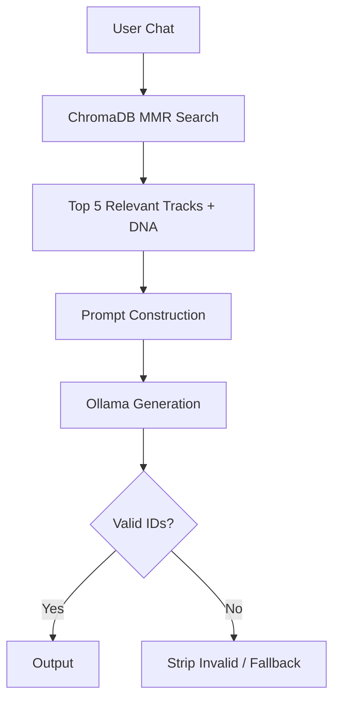

# RAG Domain Specification

## 1. Domain Overview
The Retrieval-Augmented Generation (RAG) Domain governs how the AI Assistant sources truth, ensuring high-quality, hallucination-free responses based on the user's SpotiGram data.

## 2. Aggregates & Entities
- **Aggregate Root:** `KnowledgeBase`
- **Entities:** `VectorDocument`, `RetrievalSession`

## 3. Business Rules

### Knowledge Sources
- **User Music DNA:** Vectorized listening history.
- **Social Graph:** Who the user follows and their recent activity.
- **Global Catalog:** Internal representations of Spotify tracks and genres.

### Policies
- **Retention Policy:** Transient context vectors (e.g., specific chat messages) are dropped after the session ends. DNA vectors are retained but updated iteratively.
- **Conversation Memory Policy:** Max 10 turns of conversational history are passed in the context window. Summarization triggers on the 11th turn.
- **Retrieval Ranking:** Uses Maximal Marginal Relevance (MMR) to ensure diverse track recommendations in the prompt context.

### Hallucination Prevention Strategy
- **Prompt Construction Rules:** System prompts strictly forbid inventing track IDs. Every suggested track must be sourced from the retrieved `KnowledgeBase` context.
- **Post-Generation Validation:** The system parses the LLM output. If an unrecognized track ID is detected, the output is stripped and the LLM is queried to retry or fallback.

## 4. Workflows

## 5. Domain Events
- `RAGRetrievalExecutedEvent(session_id, query, document_count)`
- `HallucinationDetectedEvent(session_id, invalid_entity)`

## 6. Testability Requirements
- **Unit:** Test Prompt Construction truncation logic.
- **Integration:** Test ChromaDB MMR search diversity.
