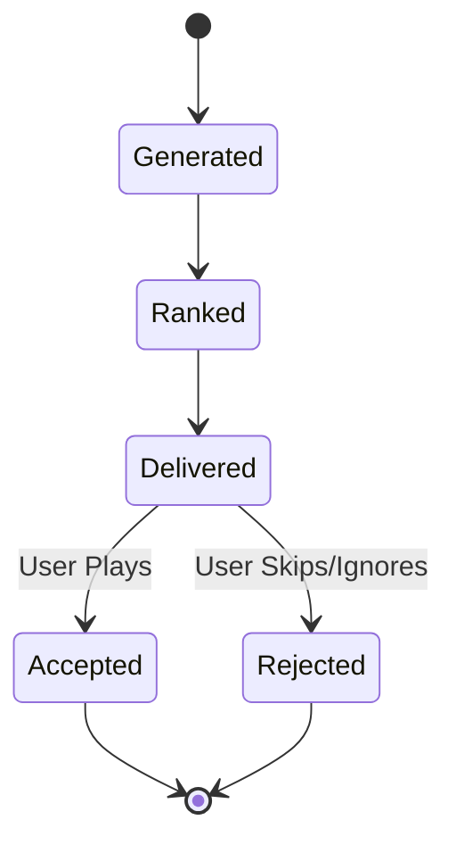

# Recommendation Domain Specification

## 1. Domain Overview
The Recommendation Domain acts on the Music DNA to deliver actionable content (tracks, playlists, users) to the frontend.

## 2. Aggregates & Entities
- **Aggregate Root:** `RecommendationEngine`
- **Entities:** `RecommendationSet`, `FeedbackLoop`

## 3. Business Rules

### Lifecycle
- **Generated:** Algorithm runs and produces raw candidates.
- **Ranked:** Candidates are scored against contextual factors.
- **Delivered:** Sent to the client API.
- **Accepted:** User engages (plays, likes) with the recommendation.
- **Rejected:** User ignores or explicitly dismisses the recommendation.

### Ranking Factors
Scores are dynamically adjusted based on:
- **Mood:** Multiplier applied to tracks matching current detected mood.
- **Music DNA:** Cosine similarity against the user's base vector.
- **Similar Users (Collaborative Filtering):** Boosting tracks popular among friends.
- **Genres & Listening History:** Filtering out recently overplayed tracks.
- **Time of Day:** Contextual boosts (e.g., acoustic in the morning).

### Strategies
- **Cold Start Strategy (New User):** Ask for 3 seed artists upon onboarding. Serve popular, broad-appeal tracks based on those seeds until 50 signals are gathered.
- **Inactive User Strategy:** Fall back to the user's last known `DNASnapshot` and blend with current global trending tracks to re-engage.
- **Feedback Loop Strategy:** If a user Rejects 3 recommendations in a row, the current contextual session is invalidated, and a randomized exploration branch is triggered.

## 4. State Transitions

## 5. Domain Events
- `RecommendationDeliveredEvent(user_id, session_id, tracks)`
- `RecommendationAcceptedEvent(user_id, track_id)`
- `RecommendationRejectedEvent(user_id, track_id)`
- `ColdStartResolvedEvent(user_id)`

## 6. Testability Requirements
- **Unit:** Test ranking factor math (ensure Time of Day boosts correctly).
- **Integration:** Test ChromaDB similarity search queries.
