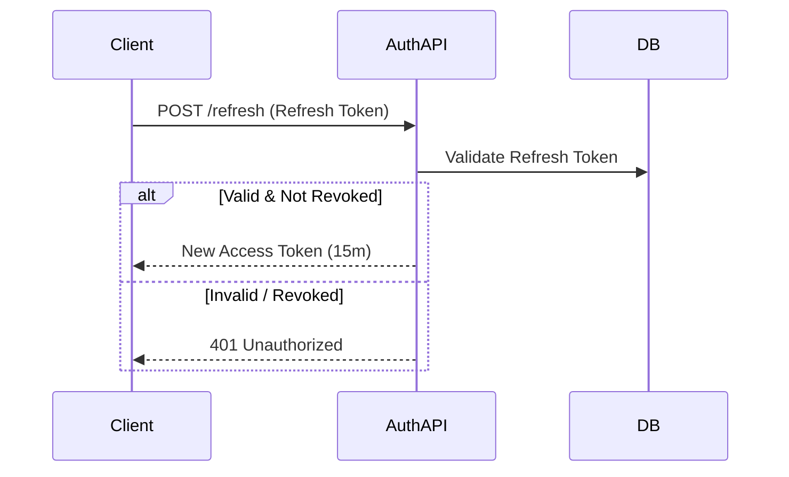

# Security Domain Specification

## 1. Domain Overview
The Security Domain handles authentication mechanisms, API authorization, cryptographic secrets, and system audit logging.

## 2. Aggregates & Entities
- **Aggregate Root:** `SecurityPrincipal`
- **Entities:** `JWTToken`, `AuditLog`

## 3. Business Rules

### Authentication & Authorization
- **Authentication:** Stateless via JWT.
- **JWT Lifecycle:** Access tokens live for 15 minutes. Refresh tokens live for 7 days.
- **Secret Rotation:** JWT signing keys must be rotated every 30 days without invalidating existing refresh tokens (JWKS pattern).
- **RBAC (Role-Based Access Control):** 
  - `Admin`: Can suspend users, delete any post.
  - `User`: Standard interactions.
  - `Guest`: Read-only access to public playlists/profiles.

### Constraints & Auditing
- **Rate Limits:** Global edge limit of 100 req/min per IP.
- **Audit Logs:** All `Admin` actions (suspensions, deletions) must be written to an immutable `AuditLog` table.

## 4. Workflows

## 5. Domain Events
- `UserAuthenticatedEvent(user_id, ip_address)`
- `SuspiciousActivityDetectedEvent(user_id, reason)`
- `AdminActionAuditedEvent(admin_id, action_type, target_id)`

## 6. Testability Requirements
- **Unit:** Test JWT expiration rejection, RBAC guard decorators.
- **Integration:** Test Refresh token revocation flows.
