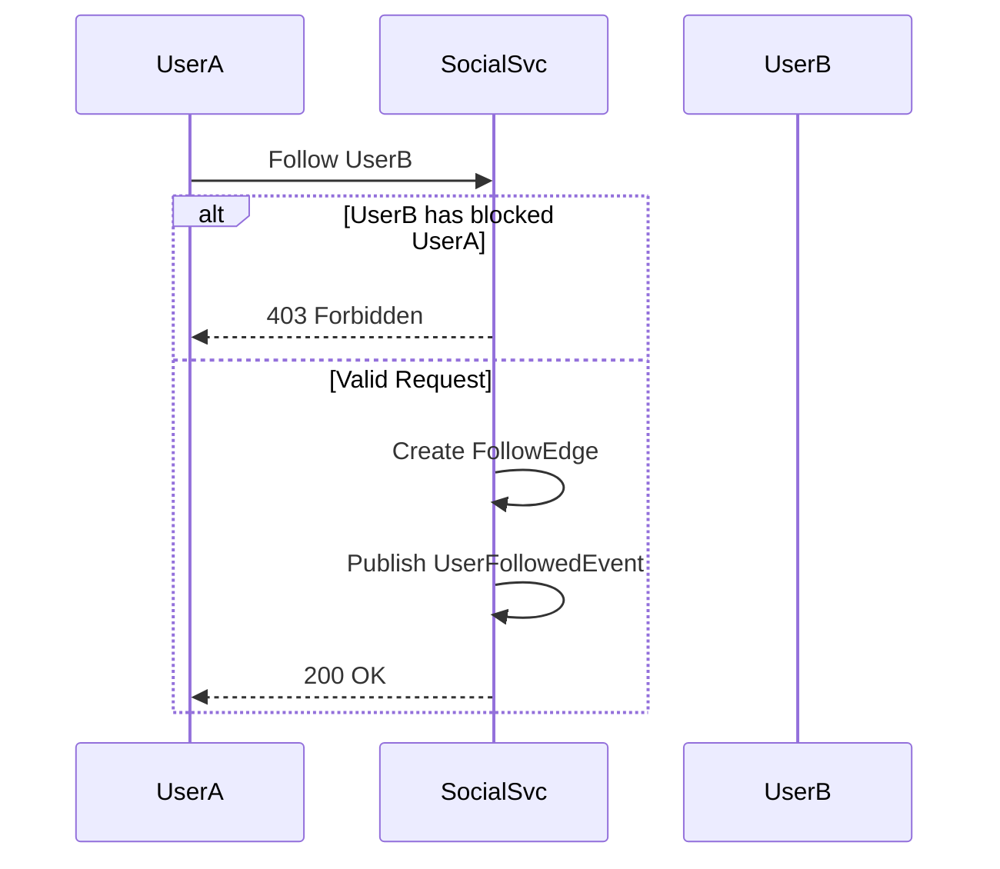

# Social Domain Specification

## 1. Domain Overview
The Social Domain manages interpersonal connections (follows, blocks) and content interactions (likes, shares, reposts, comments) across the SpotiGram ecosystem.

## 2. Aggregates & Entities
- **Aggregate Root:** `SocialGraph`, `Interaction`
- **Entities:** `FollowEdge`, `BlockEdge`, `MuteEdge`, `Comment`, `Like`

## 3. Business Rules

### Relationships
- **Follow/Unfollow:** Users can follow active users. Self-follow is strictly prevented.
- **Block/Unblock:** Users can block others. Blocking forces an unfollow on both sides.
- **Mute/Unmute:** Users can mute others. Muted users do not appear in the feed but remain followers/following.
- **Constraint:** Cannot follow a user who has blocked you, or whom you have blocked.
- **Constraint:** Cannot interact (like, comment, share) with suspended accounts or blocked accounts.

### Interactions
- **Like / Unlike Song:** Users can like a song post. Duplicate likes are prevented (upsert logic).
- **Share / Repost Song:** Reposting creates a new feed entry referencing the original post ID.
- **Comment / Delete Comment:** Users can comment on posts. Users can delete their own comments; post owners can delete any comment on their post.

## 4. State Transitions & Workflows

## 5. Permissions Matrix

| Action | Owner | Target User | Admin |
|--------|-------|-------------|-------|
| Follow | N/A | Yes (if not blocked) | Yes |
| Block | N/A | Yes | Yes |
| Like Post | N/A | Yes (if not blocked) | Yes |
| Delete Comment | Yes | No (unless post owner) | Yes |

## 6. Domain Events
- `UserFollowedEvent(follower_id, followee_id)`
- `UserUnfollowedEvent(follower_id, followee_id)`
- `UserBlockedEvent(blocker_id, blocked_id)`
- `PostLikedEvent(user_id, post_id)`
- `PostRepostedEvent(user_id, original_post_id)`
- `CommentCreatedEvent(comment_id, post_id, user_id)`
- `CommentDeletedEvent(comment_id)`

## 7. Edge Case & Error Handling
- **Race Condition on Follow/Block:** If User A follows User B exactly as User B blocks User A, the DB transaction must serialize to ensure the follow is rejected or deleted.
- **Deleted Posts:** Interactions on deleted posts return 404 Not Found.

## 8. Testability Requirements
- **Unit:** Test self-follow rejection, duplicate like prevention.
- **Integration:** Test cascading deletes (if a user is hard deleted, drop their follow edges).
- **E2E:** Follow -> Block -> Verify unfollow logic triggers correctly.
