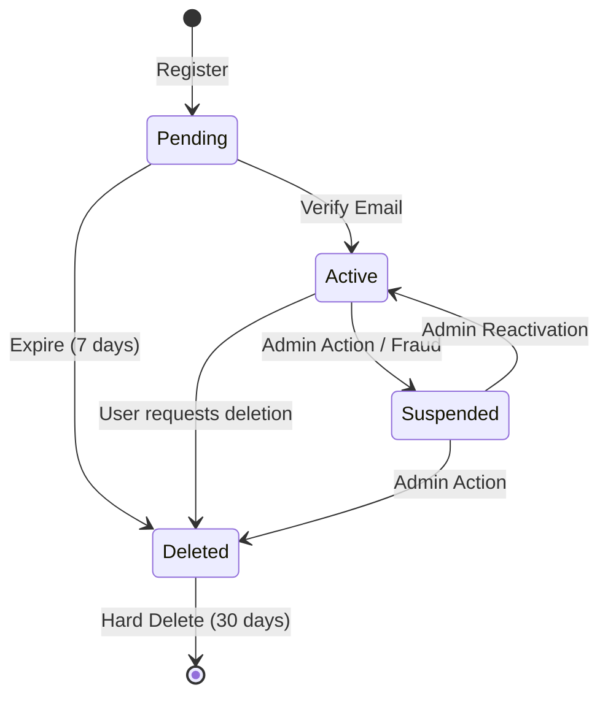

# User Domain Specification

## 1. Domain Overview
The User Domain is the core authority on identity, profiles, and account lifecycles within SpotiGram. It handles registration, authentication, privacy, and account states.

## 2. Aggregates & Entities
- **Aggregate Root:** `UserAccount`
- **Entities:** `UserProfile`, `UserPrivacySettings`

## 3. Business Rules & Validation

### Registration & Lifecycle
- **Registration:** Users must register with a unique email and username.
- **Account Activation:** Accounts begin in `Pending` state. Email verification moves them to `Active`. Unverified accounts are purged after 7 days.
- **Password Reset:** Requires a valid email verification code. Expires in 15 minutes.
- **Account Deletion:** Users can request deletion. Moves state to `Deleted` (Soft Delete).
- **Soft Delete Behavior:** User data remains in DB but is obscured (username changed to `DeletedUser_UUID`). Cannot log in. Hard deletion occurs after 30 days.
- **Suspension:** Admins or automated fraud systems can set state to `Suspended`. Suspended users cannot log in.
- **Reactivation:** Admins can transition `Suspended` -> `Active`.

### Validation Rules
- **Username:** Alphanumeric, 3-20 characters, must be unique across the system.
- **Email:** Must be a valid format and unique.
- **Password:** Minimum 8 characters, at least 1 number, 1 uppercase, 1 special character.
- **Rate Limits:** Max 5 failed login attempts per 15 minutes (triggers temporary lockout). Max 3 registration attempts per IP per hour.

## 4. State Transitions

## 5. Permissions Matrix

| Action | Guest | User | Admin |
|--------|-------|------|-------|
| View Public Profiles | Yes | Yes | Yes |
| Edit Own Profile | No | Yes | Yes |
| Delete Own Account | No | Yes | Yes |
| Suspend Account | No | No | Yes |
| Hard Delete Account | No | No | Yes |

## 6. Domain Events
- `UserRegisteredEvent(user_id, email, username)`
- `UserActivatedEvent(user_id)`
- `UserSuspendedEvent(user_id, reason)`
- `UserDeletedEvent(user_id)`
- `UserProfileUpdatedEvent(user_id, changed_fields)`

## 7. Edge Case & Error Handling
- **Duplicate Registration:** Return HTTP 409 Conflict with sanitized error message (do not confirm if email exists for security).
- **Login during Suspension:** Return HTTP 403 Forbidden with support contact info.

## 8. Testability Requirements
- **Unit:** Test password hashing, validation logic, and state transition guards.
- **Integration:** Test Postgres constraint violations (duplicate emails).
- **Contract:** Verify API response schemas for profile updates.
- **E2E:** Full registration -> activation -> login flow.
